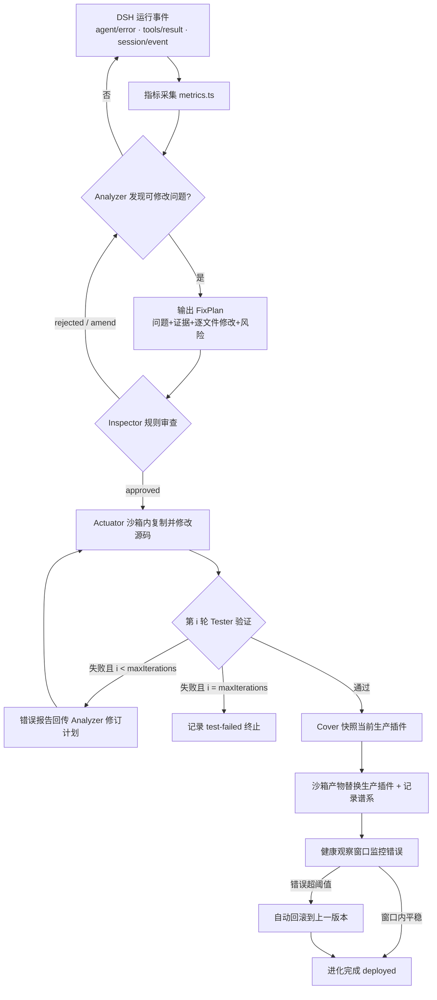
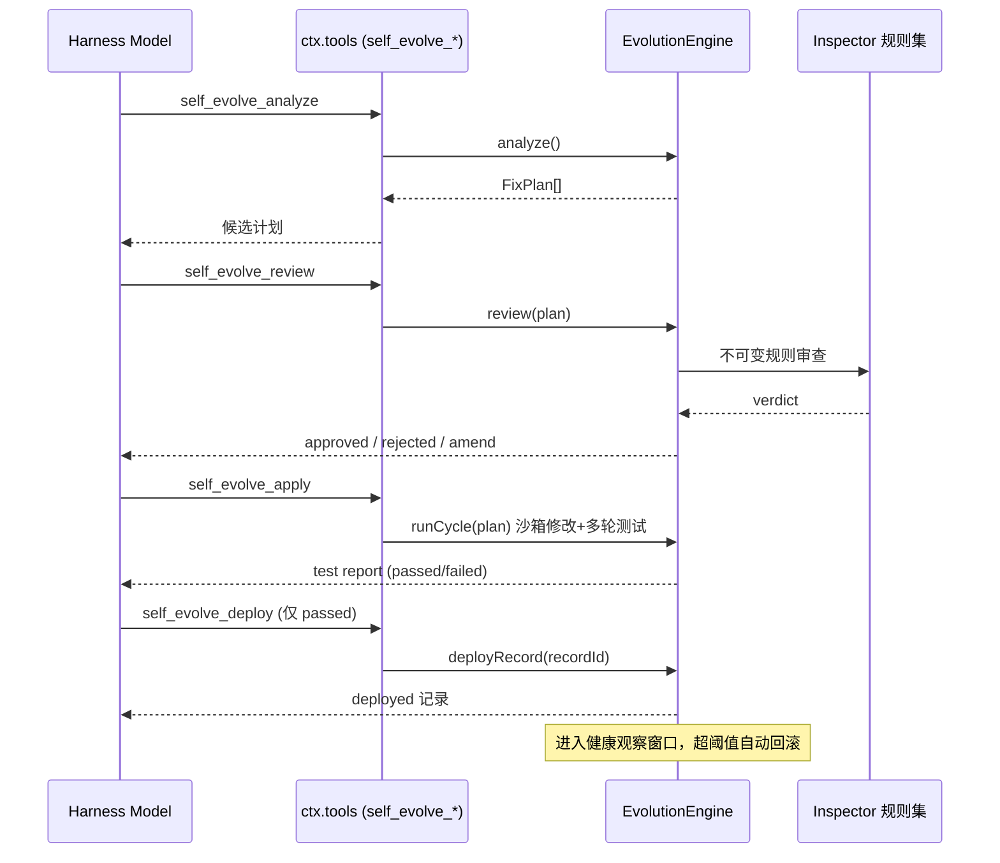

# DSH 自进化插件系统 · 工作流程文档

> 配合 [INTRO.md](./INTRO.md) 阅读。本文给出从"发现问题"到"安全上线/回滚"
> 的完整工作流、每一步的输入输出、审查清单，以及 `sep` CLI 的操作手册。

---

## 0. 一键安装到 DSH

DSH 为插件提供统一安装入口。本项目封装了**一条命令**即可完成的安装脚本：

```sh
# 跨平台（Node 脚本，推荐）
node scripts/install-dsh-plugin.mjs            # 默认：本地构建后装到 web profile

# 或从仓库根 package.json 入口
pnpm install:dsh          # 装到 web
pnpm install:dsh:tui      # 装到 tui 终端
pnpm install:dsh:dry      # 试运行（只打印，不改动）
```

脚本自动完成：**构建插件 → 安装依赖到目标 profile → 注入组合清单 → 提示重启**。
底层优先调用官方命令 `dsh plugin --profile <p> add <source>`；无 `dsh` 命令时
自动回退为在 `~/.dsh/profiles/<p>` 直接 `pnpm add` 并写 `cordis.patch.yml`。

- 三种等价脚本：`install-dsh-plugin.mjs`（跨平台）/ `.ps1`（Windows）/ `.sh`（bash）
- 支持 `--source`：留空（本地构建）/ npm 包 / `github:user/repo` / 本地路径
- 安装后**重启 dsh**，在"设置 → 插件列表"即可看到 `self-evolution`
- 验证：`dsh --profile web --dump-config` 确认插件已加载

> 完整说明见 [scripts/README.md](./scripts/README.md)。

---

## 1. 端到端流程图



---

## 2. 各环节契约

| 环节 | 负责模块 | 输入 | 输出 | 终止/失败条件 |
|---|---|---|---|---|
| 采集 | `metrics.ts` | DSH 类型化事件 | `EvolutionMetrics` / `EvolveSignal[]` | — |
| **Analyzer** | `analyzer.ts` | 指标信号 + 插件源码根 | `FixPlan[]` | 无信号 / 目标插件已在进化中 |
| **Inspector** | `inspector.ts` | `FixPlan` + 只读上下文 | `InspectorVerdict` | `error` 发现 → rejected |
| **Actuator** | `actuator.ts` | 已批准 `FixPlan` | `ApplyResult`（沙箱副本） | 锚点不匹配 / 越界路径 |
| **Tester** | `tester.ts` | 沙箱副本 + 计划 | `TestReport` | 任一事例失败 |
| **Cover** | `cover.ts` | 已通过记录 + 沙箱路径 | `EvolveRecord`（deployed） | 生产包缺失 / 快照失败 |
| 谱系 | `registry.ts` | 各环节结果 | JSONL 持久化记录 | — |

### 2.1 迭代循环

- 单周期迭代上限 `maxIterations`（默认 3）。
- 每轮失败，Tester 的错误报告被 `Analyzer.revise(plan, errorReport)` 并入计划的
  evidence 与 problem 描述，携带失败证据进入下一轮。
- 达到上限仍失败 → 记录 `test-failed`，**不部署**，谱系保留失败痕迹。

---

## 3. 模型驱动的自进化（默认路径）

装入插件后，harness 自身模型可调用六个工具，形成"模型提议 → 规则把关"的闭环：



**最小安全要求**：`apply` 只能作用于 `review` 批准的 `FixPlan`；`deploy` 只接受
`passed` 状态的记录；两者由引擎内部状态机强制，与工具调用顺序无关。

---

## 4. 部署与回滚流程

### 4.1 部署（Cover）

1. 校验记录状态必须为 `passed`，否则拒绝；
2. 在 `backupRoot` 快照当前生产插件（父版本）；
3. 删除生产插件目录，以沙箱产物复制替换；
4. 谱系记录置为 `deployed`，写入 `deployedAt`；
5. 启动健康观察窗口（默认 10 分钟 / 5 次错误）。

### 4.2 自动回滚

- 健康窗口内累计错误数 ≥ 阈值 → 从最近快照恢复生产插件；
- 谱系记录置为 `rolled-back`，写入 `rollbackAt` 与原因；
- 每个部署只触发一次自动回滚（防止抖动）。

### 4.3 手动回滚（`ctx.selfEvolution.rollback`）

```ts
await ctx.selfEvolution.rollback('my-tool', 'observed regression after deploy')
```

---

## 5. 审查清单（Inspector 规则 → 人类/模型复核要点）

在批准/部署前，至少确认：

- [ ] 目标插件在 `allowlist` 内，且不在 `protected` 列表；
- [ ] 所有修改文件都位于插件包根内（无路径穿越）；
- [ ] `package.json` 的 `main`/`types`/`exports` 未被破坏；
- [ ] 修改内容不含高危模式（`process.exit`、`eval`、子进程、网络等）；
- [ ] 每个 `edit` 的 `oldText` 与当前源码精确匹配（Diff 分析器可复核）；
- [ ] 计划携带证据、问题描述、预期影响与合理规模；
- [ ] 沙箱测试通过（含 A/B 无回归）；
- [ ] 生产插件已有快照，回滚路径可达。

---

## 6. `sep` CLI 操作手册

```text
sep scaffold    生成符合 DSH 规范的插件骨架
sep contract    接口契约校验（晋升门禁）
sep diff        基线 vs 候选 结构 diff + 风险检测
sep bench       沙箱基准测试 / A/B 对比
sep version     版本快照与切换（push/list/rollback）
sep health      健康观察与自动回滚
```

### 6.1 scaffold

```sh
sep scaffold --name my-tool --dir ./packages/my-tool \
             --group support --description "..." \
             [--dual-face] [--with-tests] [--version 0.1.0] [--namespace @deepseek-ai]
```

生成：`package.json`（私有、ESM、`main`/`types`/`exports` 不变式）、`tsconfig.json`
（`.ts` 后缀导入编译时重写为 `.js`）、`src/index.ts` 插件骨架、`README.md`；
`--dual-face` 额外生成 `src/client/index.ts` 与 `dsh.client` 声明。

### 6.2 contract（晋升门禁）

```sh
sep contract --plugin ./packages/my-tool
```

- 通过：`ok: true`，退出码 0；
- 失败：列出 `error`/`warning` 发现，退出码 1（例如未构建、`exports["./client"]` 缺失）。

### 6.3 diff（供审查）

```sh
sep diff --base ./backup/my-tool@v1 --candidate ./packages/my-tool
```

输出逐文件 `added/removed/modified`、行数统计、带起始行号的 hunks、新增高危标记；
存在高危标记时 `riskLevel: "high"` 且退出码 1。

### 6.4 bench（沙箱基准 / A/B）

```sh
# 任务集：tasks.json = [{ "id","name","command","timeoutMs" }]
sep bench --plugin ./packages/my-tool --tasks ./tasks.json [--sandbox ./.sep-sandbox]
sep bench --plugin ./packages/my-tool --baseline ./backup/my-tool@v1 \
          --tasks ./tasks.json --sandbox ./.sep-sandbox
```

A/B 判定：候选失败而基线通过、或延迟退化 >20% 且 >100ms → `regressions` + `verdict: fail`（退出码 1）。

### 6.5 version（快照与切换）

```sh
sep version push  --state ./.sep/versions --active ./packages --plugin my-tool --version v2 --source ./packages/my-tool [--message "..."]
sep version list  --state ./.sep/versions --active ./packages --plugin my-tool
sep version rollback --state ./.sep/versions --active ./packages --plugin my-tool [--version v1]
```

快照目录：`<state>/snapshots/<plugin>/<version>`；账本 `<state>/ledger.json`。

### 6.6 health（自动回滚监控）

```sh
sep health --state ./.sep/versions --active ./packages --plugin my-tool \
           --max-errors 5 --window 600000 --count 1
```

窗口内累计错误达到阈值即回滚到上一版本，并把受影响版本标记 `unhealthy`。

---

## 7. 监控与可观测性

- 插件广播 10 类 `evolution/*` 类型化事件，可被日志/Web 面板消费；
- 谱系 JSONL 记录了每个计划的完整旅程（审查结论、测试报告、部署/回滚时间）；
- 指标采集器可随 `evolution/metrics` 事件输出错误/延迟/失败率快照；
- `evolution/rolled-back` 事件是健康异常的核心告警信号。

---

## 8. 运维建议

1. 先以 `--with-tests` 脚手架 + `contract` 门禁建立基线；
2. 用 `bench`（A/B）把关键行为固化为任务套件，作为每次进化的回归门禁；
3. 部署前用 `diff` 复核审查清单（§5）；
4. 部署后保留健康观察窗口，避免手动回滚；
5. 定期导出谱系 JSONL 做进化审计与可视化。
